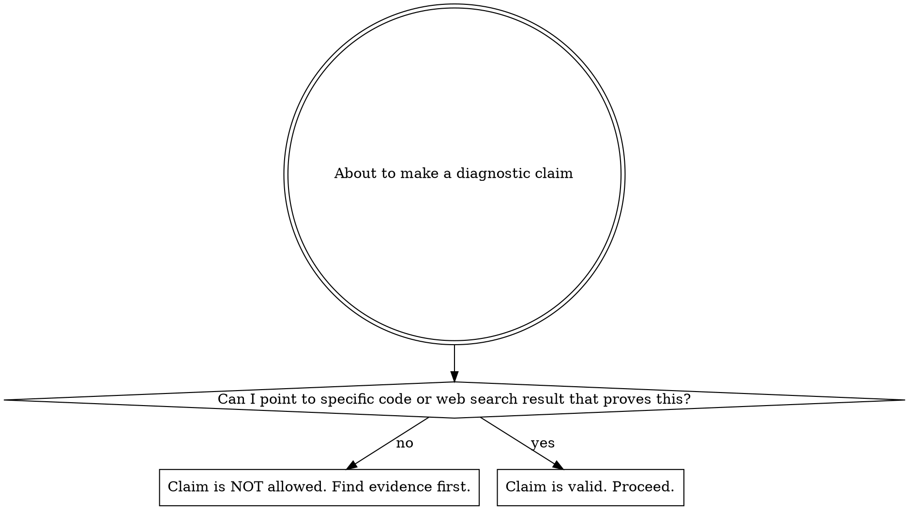

# Evidence-Based Debugging

## Overview

Every diagnostic claim must be backed by concrete evidence. Never guess. Never rely on training data as a substitute for reading the actual code.

**Violating the letter of these rules is violating the spirit of these rules.**

## When to Use

This skill applies to ALL debugging and bug-fixing tasks. No exceptions.

Flowchart for every diagnostic claim:

## Evidence Hierarchy

### Acceptable Evidence (ranked by strength)

1. **Code reading** — the actual source file, read with Read tool, showing the bug
2. **Git history** — `git log`, `git blame`, `git diff` showing what changed and when
3. **Grep/search results** — finding all call sites, references, or related patterns
4. **Runtime output** — stack traces, error messages, log output from actual execution
5. **Web search results** — documentation, bug reports, or discussions found via WebSearch (not training data recall)
6. **Test output** — failing test results that demonstrate the bug

### NOT Acceptable Evidence

- "This is a common pattern..." — common patterns have exceptions; read the code
- "Based on my training data..." — training data is frozen in time; read the current code
- "Usually this means..." — you need certainty, not probability
- "I've seen this before..." — every codebase is different; verify
- "It's probably..." — probability is not proof
- "For some reason..." — if you can't explain the reason, you haven't found the bug
- "e.g., [speculation about environment/configuration]" — speculation is not evidence

## Core Rules

### Before Proposing ANY Fix

1. Read the relevant file(s) where the bug is reported
2. Trace the code path from entry point to the suspected failure point
3. If the bug might be a regression, check `git log` for recent changes
4. Identify the SPECIFIC line or condition that causes the failure
5. If dealing with external system behavior (remote servers, OS tools, network), verify with actual documentation or test output — do not assume

### After Applying a Fix

Clean up immediately. Do not leave garbage behind:

1. Delete any intermediate files created during debugging (test scripts, debug logs, temp dumps)
2. Delete any temporary test files or diagnostic output files
3. If you created a file just to reproduce the bug and it's no longer needed — delete it
4. If you wrote `print()` or logging statements purely for debugging — remove them
5. Verify with `git status` that no untracked junk remains

**No debug artifacts in the final state.** The only changes that should remain are the actual fix and its tests.

### The Evidence Test

Before stating a root cause, ask: "What specific code line or web search result proves this?"

If the answer is "my training data" or "common knowledge" — stop and find actual evidence.

## Red Flags — STOP and Find Evidence

- "This is probably..."
- "It looks like..."
- "Usually..."
- "For some reason..."
- "e.g., [unsupported speculation]"
- "This is a common issue with..."
- Proposing a fix before reading the relevant file
- Relying on training data memory of library/API behavior
- Assuming remote/external system behavior without verification
- Creating debug files, temp scripts, or diagnostic dumps without deleting them after

**Any of these phrases in your reasoning means: STOP. Read the code. Search the web. Find evidence.**

## Common Mistakes

| Mistake | Fix |
|---------|-----|
| Reading code but still guessing WHY it fails | Trace the actual failure path; run the code or check git history |
| Assuming the "obvious" cause from an error message | Error messages can be misleading; read the code that produces them |
| Proposing changes without establishing root cause | Root cause first, then fix; never fix symptoms |
| Using training data to explain library behavior | Libraries change; search for current docs or read the actual dependency version |
| Speculating about remote/external environment | Verify with actual commands or documentation |
| Leaving debug files, temp scripts, or print() statements after fixing | Clean up immediately after fix verified; check `git status` |

## Rationalization Table

| Excuse | Reality |
|--------|---------|
| "This is a common pattern" | Common patterns have exceptions. Read the actual code. |
| "I've seen this before" | Every codebase is different. Verify with current code. |
| "It's obvious from the error" | Error messages can be misleading. Trace the source. |
| "My training data says X" | Training data is frozen. Read the current code. |
| "For some reason it fails" | If you can't explain the reason, you haven't found the bug. |
| "The fix is simple" | Simple fixes still need evidence. Being simple doesn't make it correct. |
| "This is urgent, no time to read" | Urgency makes evidence MORE important, not less. Wrong fixes waste more time. |
| "I'll clean up the debug files later" | Later never happens. Clean up now, before you forget. |
| "This temp script might be useful" | It's dead code. Delete it. Git history preserves it if needed later. |
